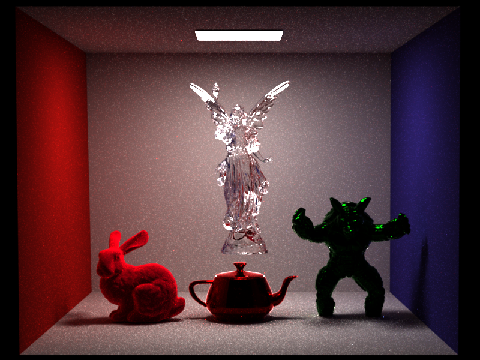
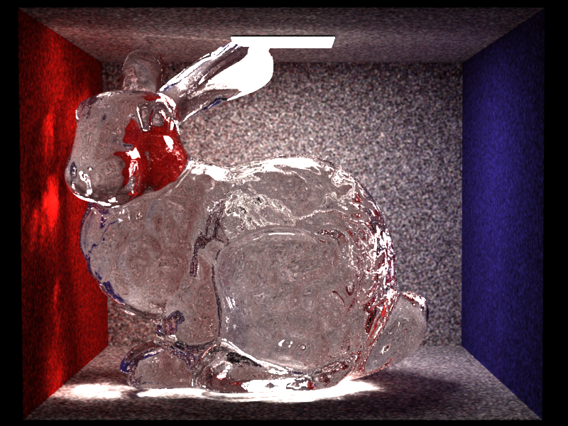
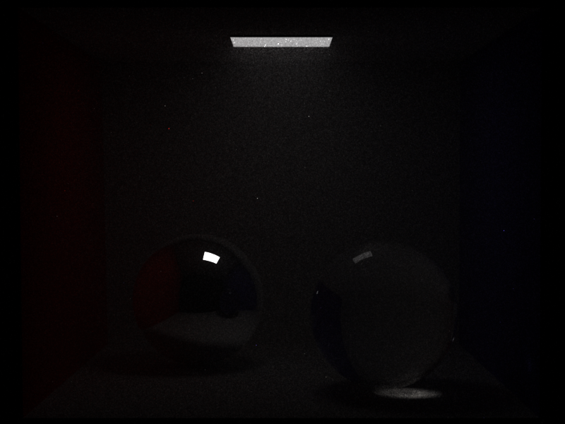

# Feature

|                          Functions                          | state   |
| :---------------------------------------------------------: | ------- |
|                       direct lighting                       | done    |
|                        Path tracing                         | done    |
|                  multi important  sampling                  | done    |
|                       photon mapping                        | done    |
|                     homogeneous medium                      | done    |
|                     volume path tracing                     | done    |
|                         Disney brdf                         | done    |
|                            bdpt                             | doing   |
|                             mlt                             | doing   |
|                   subsurfaces scattering                    | doing   |
| ppm/sppm/mmlt/vcm...(advance light transporting algorithms) | planing |

Also lots of important but trivial feature light GUI and multi-threading is done by nori.

# Image produced by WiRay

**Path tracing with Disney brdf:**

**Naive photon mapping with simple caustic:**

**Homogeneous Volume rendering:**

